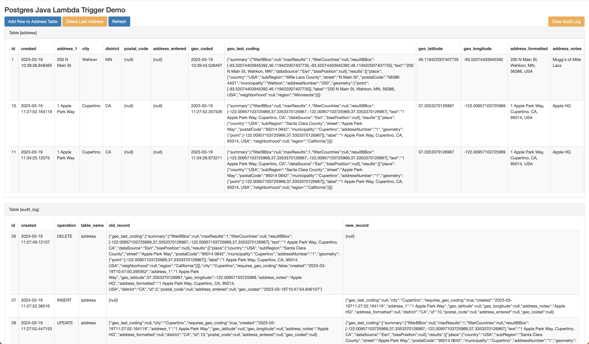

# Postgres Java Lambda Trigger Demo with UI

## Background

This project demonstrates a full working model with UI that shows how to configure all of the resources to support calling Java [Lambda functions from AWS RDS Postgress](https://docs.aws.amazon.com/AmazonRDS/latest/UserGuide/PostgreSQL-Lambda.html).  If you're already a lambda guru and just want to see how to build some kind of payload in psql then simply take a look at the [Trigger function](src/main/resources/scripts/LambdaTriggerFuction.sql).

Why even use this feature?  If you have many code bases that are writing data to Postgres, then how do you ensure that downline processing is done correctly on all data.  We typically fire off lambdas directly in code or push the id of the record to SNS or SQS.  This all works fine if all the places you insert data call the correct downline function.  But sometimes you simply need to edit or update the data directly in Postico or even just plain SQL.  By having Postgres call the Lambda you completely decouple the downline logic from the part of the appplication that inserts/updates/deletes the data.

Things to consider:
- If you fire off lambdas for row updates that themselves update the DB then you can quickly exaust connection and lambda resources.  If you update 1000 rows then you could have hundreds of lambdas fire and connect to the DB bringing everything to a grinding halt.  Therefore you should set [concurrency limits](https://aws.amazon.com/blogs/compute/managing-aws-lambda-function-concurrency/) on these lambda functions in most cases.
- When you exceed the limit, you get a throttle on the lambda, and these will delay processing.  In some cases this OK, in the Geo coding use case we don't need the Geo coding to complete immediately, so it's OK.  In testing 1K+ row updates for Geo coding some row updates took over 1 minute to complete because of the retry back off.
- If you need smoother execution of the events, then consider using a simple NodeJS Lambda (that won't be throttled) that takes the event payload and puts it on a SQS queue that another Lambda will process from the queue.  See an example of this in the [template.yaml](template.yaml#L198) file.

Three use cases are covered in this demo:
- A Lambda([PostgresAddressTrigger.java](src/main/java/demo/PostgresAddressTrigger.java)) that will update the same row that the trigger is firing on.  In this case, we have an address table, and when addresses are inserted or updated, they will be geo-coded by the [AWS Location API](https://docs.aws.amazon.com/location/latest/APIReference/API_SearchPlaceIndexForText.html).  Special care is needed in this case to prevent recursive triggering of the function.
- A Lambda ([PostgresAuditLogTrigger.java](src/main/java/demo/PostgresAuditLogTrigger.java)) that will simply log all actions on the address table to an audit_log table.  As shown in some AWS examples, you could then simply put the payload onto a SNS Topic or SQS Queue for downline processing.
- A Lambda ([PostgresAuditLogTriggerSQS.java](src/main/java/demo/PostgresAuditLogTriggerSQS.java)) that will simply log all actions on the address table to an audit_log_sqs table.  This shows how to process the same event above from a SQS Queue.

Another goal of the project was to demonstrate:
- SAM CloudFormation example for all the components in play (`sam build` and then `sam deploy`) for simple deployment of the project.
- Managed RDS Secret for connecting to the DB and use of the [AWS JDBC Driver](https://docs.aws.amazon.com/secretsmanager/latest/userguide/retrieving-secrets_jdbc.html).
- [Custom Resource](https://docs.aws.amazon.com/AWSCloudFormation/latest/UserGuide/template-custom-resources.html) to initialize the DB after creation ([CloudFormationCustomResource.java](src/main/java/demo/CloudFormationCustomResource.java)).  Namely to enable the lambda extensions and create all the SQL resources necessary in Postgres.
- Nested Stacks.
- To simply provide a full working example with Java and AWS RDS Postgres (what I use day to day).  The AWS Demo is MySQL with Node and there was nothing I could find that really showed a full use case in Java.


## Contents
This project contains source code and supporting files for a serverless application that you can deploy with the SAM CLI. It includes the following files and folders.

- [/src/main/java/demo](src/main/java/demo) - Java Lambda Functions
- [/src/main/resources/scripts](src/main/resources/scripts) - SQL Scripts used to initialize the DB from the [Custom Resource](https://docs.aws.amazon.com/AWSCloudFormation/latest/UserGuide/template-custom-resources.html) ([CloudFormationCustomResource.java](src/main/java/demo/CloudFormationCustomResource.java)) in CloudFormation.
- CloudFormation scripts for all AWS resources
	- [vpc.yaml](vpc.yaml) - Creates simple VPC with 2 public subnets
	- [postgres.yaml](postgres.yaml) - Creates Auora Postgres Cluster with single serverlessV2 node and permissions to execute lambda functions.
	- [template.yaml](template.yaml) - Creates all the lambda functions

The application uses several AWS resources, including Lambda functions and an API Gateway API. These resources are defined in the `template.yaml` file in this project.

## Deploy the Demo

The Serverless Application Model Command Line Interface (SAM CLI) is an extension of the AWS CLI that adds functionality for building and testing Lambda applications. It uses Docker to run your functions in an Amazon Linux environment that matches Lambda. It can also emulate your application's build environment and API.  Before proceeding, it is assumed you have valid AWS credentials setup with the AWS CLI and permissions to perform CloudFormation stack operations.

To use the SAM CLI, you need the following tools.

* SAM CLI - [Install the SAM CLI](https://docs.aws.amazon.com/serverless-application-model/latest/developerguide/serverless-sam-cli-install.html)
* Java11 - [Install the Java 11](https://docs.aws.amazon.com/corretto/latest/corretto-11-ug/downloads-list.html)
* Maven - [Install Maven](https://maven.apache.org/install.html)

If you have brew installed then
```bash
brew install aws-sam-cli
brew install corretto11
brew install maven
```

To build and deploy, run the following in your shell after you have cloned the repo:

```bash
postgres-lambda-trigger$ sam build
postgres-lambda-trigger$ sam deploy
```

The first command will build the source of the application. The second command will package and deploy the demo application to AWS.  You will see the progress as the stack deploys, be patient as it does take a while to spin up the Aurora Cluster and serverless postgres node. `Do not forget to delete the stack or you will continue to incure AWS charges for the DB`.  


You can find the API Gateway Endpoint URL in the output values displayed after deployment.  Open the URL with a web browser.

## Play with the demo UI and observe the table entries



When you open the API GW Endpoint URL in your browser you will see the above UI.  When the DB initializes, one address row is inserted for you, so you should see 1 row with an address Geo encoded and 2 entries in the `audit_log` tables.  The UI displays all the rows in both `address` and `audit_log` tables.  There are four actions to perform in the demo:

- Add Row to Address Table - This adds Apple's HQ address to the table.  Normally after the refresh you would see the row without geo encoding.  If you then hit `Refresh`, you should see the Geo data populated into the row.
- Add 5 Rows to Address Table - This adds 5 different addresses to the table.  Normally after the refresh you would see the rows without geo encoding.  If you then hit `Refresh`, you should see the Geo data populated into the rows.  Due to throttling this last one might be delayed a little.
- Delete Last Address - This deletes the last address row from the `address` table.  You should see the last row go away and an `audit_log` row for the delete action.
- Refresh - Does a simple refresh of the page (which reads all the tables again)
- Clear Audit Log - Truncates the `audit_log` tables.

## Fetch, tail, and filter Lambda function logs

To simplify troubleshooting, SAM CLI has a command called `sam logs`. `sam logs` lets you fetch logs generated by the deployed Lambda functions from the command line. In addition to printing the logs on the terminal, this command has several nifty features to help you quickly see what's going on with the demo.


```bash
postgres-lambda-trigger$ sam logs --tail
```

You can find more information and examples about filtering Lambda function logs in the [SAM CLI Documentation](https://docs.aws.amazon.com/serverless-application-model/latest/developerguide/serverless-sam-cli-logging.html).


## Cleanup

To delete the demo, use the SAM CLI. `DO NOT FORGET TO RUN THIS OR YOU WILL CONTINUE TO BE CHARGED FOR AWS RESOURCES` (Namely the Aurora Postgres Cluster Node).  You can run the following:

```bash
postgres-lambda-trigger$ sam delete
```

